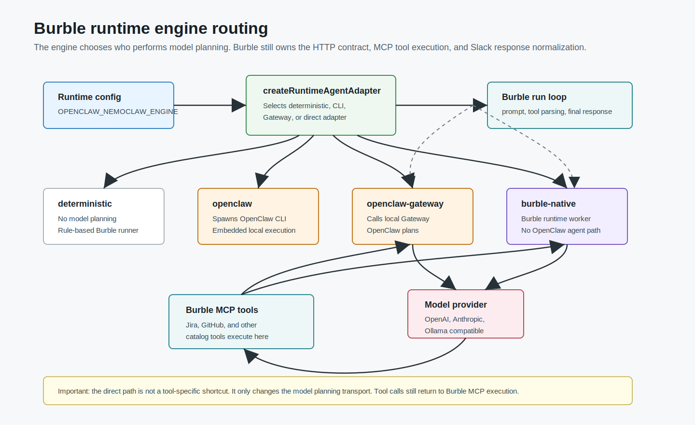
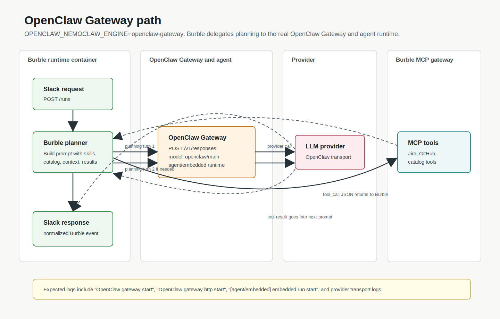
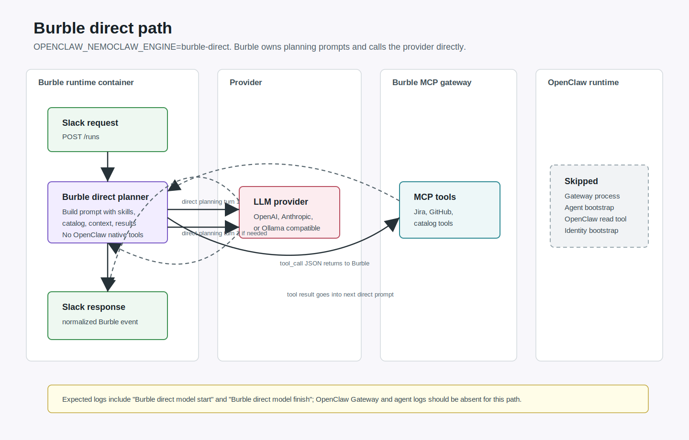

# OpenClaw Runtime Flows

These diagrams describe how Burble routes runtime requests after the
`burble-direct` split.

## Engine Routing

`OPENCLAW_NEMOCLAW_ENGINE` selects the model planning path. The Burble runtime
contract, prompt assembly, tool-call parsing, MCP tool execution, and final
Slack response handling stay in Burble.



PNG: [engine-routing-overview.png](assets/openclaw-runtime-flows/engine-routing-overview.png)

## OpenClaw Gateway Path

Use `OPENCLAW_NEMOCLAW_ENGINE=openclaw-gateway` when testing the real OpenClaw
Gateway and agent runtime. Burble asks OpenClaw to plan; OpenClaw then talks to
the model provider.



PNG: [openclaw-gateway-flow.png](assets/openclaw-runtime-flows/openclaw-gateway-flow.png)

## Burble Direct Path

Use `OPENCLAW_NEMOCLAW_ENGINE=burble-direct` for the latency-sensitive Slack
path. Burble keeps its own MCP tool loop, but planning turns go directly to the
configured provider.



PNG: [burble-direct-flow.png](assets/openclaw-runtime-flows/burble-direct-flow.png)

## Provider Tool Path

Personal OpenClaw/NemoClaw runtimes now call provider tools through MCP only:

```text
runtime
  -> agentgateway /mcp                 # optional, validates runtime JWT
  -> burble-app /mcp                   # all provider tools
  -> burble provider modules
       github MCP tools
       jira MCP tools
       slack MCP tools
       atlassian upstream MCP adapter
```

When the `docker-compose.agentgateway.yml` override is enabled, agentgateway
also exposes provider-scoped routes for future routing and policy work:

```text
/mcp/github    -> burble-app /mcp/github
/mcp/jira      -> burble-app /mcp/jira
/mcp/slack     -> burble-app /mcp/slack
/mcp/atlassian -> burble-app /mcp/atlassian
```

The legacy `/internal/tools/:tool/execute` endpoint remains available for older
Burble callers, but isolated runtime containers should not use it.

## Operational Expectations

`openclaw-gateway` logs should include:

```text
OpenClaw gateway start
OpenClaw gateway http start
[agent/embedded] embedded run start
[openai-transport] [responses] start
```

`burble-direct` logs should include:

```text
Burble direct model start
Burble direct model finish
```

`burble-direct` logs should not include OpenClaw agent bootstrap or native
OpenClaw tool activity for a normal Slack request:

```text
OpenClaw gateway start
[agent/embedded] embedded run start
[agent/embedded] embedded run tool start: tool=read
Bootstrap pending
identity setup
```
